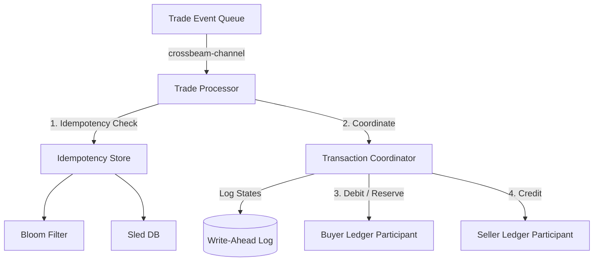
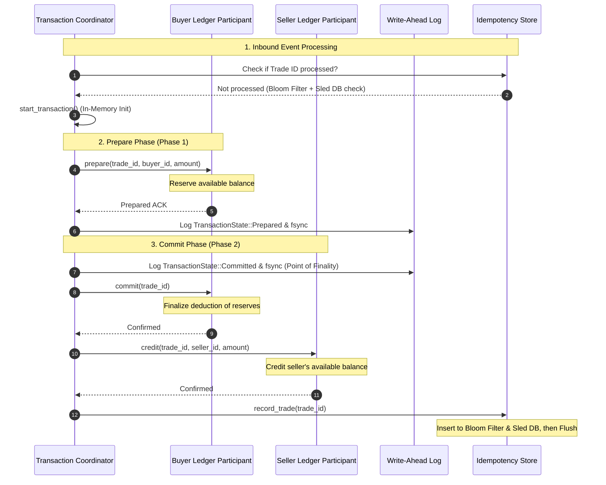

# Distributed Clearing & Settlement Engine (DCSE)

The DCSE represents a fundamental shift in fintech engineering from order execution (matching) to transactional finality (settlement). While matching engines are fundamentally high-frequency queuing problems, settlement is a distributed state machine problem. Ensuring funds move across disparate ledgers without data loss, race conditions, or double-spending is the critical engineering challenge this system addresses.

---

## 1. Architectural System Design

The system implements the **Two-Phase Commit (2PC)** pattern to guarantee atomic settlement across isolated ledgers. Below are the structural and flow diagrams of the engine.

### System Components



### Two-Phase Commit (2PC) Lifecycle Flow



---

## Documentation Directory

To thoroughly understand the architecture, testing, and performance metrics of this engine, please refer to the comprehensive engineering documentation:

- [ANALYSIS.md](./ANALYSIS.md): A deep dive into the theoretical and conceptual underpinnings of the architecture.
- [BENCHMARKS.md](./BENCHMARKS.md): Throughput profiling for the Ledger and the WAL Group Commit.
- [TESTS.md](./TESTS.md): Documentation of the Chaos and Property-Based testing strategies.
- [ERRORS_FOUND_AND_FIXED.md](./ERRORS_FOUND_AND_FIXED.md): A post-mortem of a mathematically proven edge-case resolved during development.

---

## 2. Engineering Trade-offs

The DCSE architecture prioritizes **strict safety and consistency** over raw transaction throughput, selecting the following hybrid technology stack:

| Component / Choice | Alternative | Why We Chose It | Trade-off / Cost |
| :--- | :--- | :--- | :--- |
| **2PC (Two-Phase Commit)** | Eventual Consistency (Saga Pattern) | Eliminates temporary overdrafts or inconsistent intermediate states; critical for double-spend protection. | Synchronous prepare calls block locks until the commit phase completes, bounding latency. |
| **Write-Ahead Log (WAL) + fsync** | Asynchronous / Buffered I/O | Restores state deterministically after unexpected power failures or crashes. | Every state transition requires a physical fsync (`sync_all()`), bound by disk write speeds. |
| **Sled DB + Bloom Filter** | Relational DB (SQL) | Sub-millisecond duplicate checks. 99% of duplicates rejected by memory Bloom filter, falling back to Sled DB only for false positives. | Requires memory overhead for Bloom filter bit arrays and rehydration on system startup. |

---

## 3. Consistency Model & Group Commit Durability

In financial settlement, "eventual consistency" is a catastrophic failure condition. The DCSE enforces **Strict Serializability** and **Atomicity**.

Atomicity is guaranteed through the 2PC protocol:
- **Prepare Phase**: The Coordinator explicitly instructs all Participants to lock the required capital. No funds are deducted, but they are frozen. If any Participant fails or times out, the Coordinator triggers a global `Abort`, and all locks are released.
- **Commit Phase**: Only if *all* Participants successfully prepare does the Coordinator log a `Committed` state to the WAL via `fsync`. At this precise microsecond, the transaction is immutable. The Participants are then instructed to finalize the deduction. 

**Group Commit Architecture**: To achieve maximum throughput without sacrificing crash consistency, the `TransactionCoordinator` implements a `BufferedWAL`. Instead of bottlenecking on blocking `fsync` calls for every transaction, entries are buffered in memory and flushed via an asynchronous background task when either:
1. The buffer reaches a **64KB threshold**, maximizing disk I/O efficiency.
2. A **10ms latency timer** fires, ensuring no transaction remains "un-durable" for longer than an acceptable micro-delay.

## Performance & Scaling

Traditional monolithic ledgers rely on global locks to prevent race conditions, which creates massive bottlenecks. This engine solves this by utilizing **`DashMap`** for ledger accounts. This removes the global lock entirely, allowing the engine to execute true concurrent read/write operations across thousands of isolated accounts simultaneously.

Furthermore, the `TransactionCoordinator` has been refactored to use fully asynchronous `tokio` I/O. This prevents the orchestrator from blocking the main event loop while waiting for disk flushes or network latencies. Safety is prioritized over latency, but our asynchronous, lock-free architecture ensures our safety mechanisms do not throttle global throughput.

**Benchmarks**: The system's throughput profile is calibrated via the `criterion` benchmarking suite located in `benches/`. (Note: Local benchmarks require a full GCC/MSVC build environment to link and execute).

---

## 5. Build, Verification, and Benchmarking Instructions

Ensure you have Rust installed (v1.94.1 or later).

### Build the Project
Compile the library and binaries in debug mode:
```bash
cargo build
```

### Run the Test Suite
Execute unit tests, integration tests, and the proptest suite:
```bash
cargo test
```

### Run Micro-Benchmarks
Run the `LedgerParticipant` state transition benchmarks in optimized release mode to verify operational throughput:
```bash
cargo run --release --bin bench
```
Typical output metrics:
* **Prepare**: ~4.3M TPS (Latency: ~227 ns/op)
* **Commit**: ~2.6M TPS (Latency: ~380 ns/op)
* **Credit**: ~4.6M TPS (Latency: ~215 ns/op)
* **Abort**: ~4.8M TPS (Latency: ~207 ns/op)
